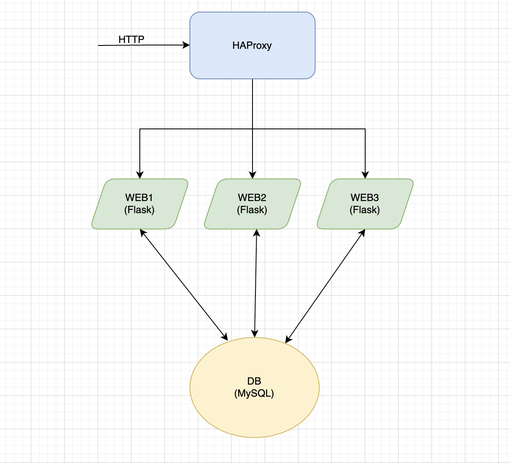

# ThinkOn Mini Project – Web App Deployment Stack

This repository demonstrates a complete deployment stack using **HAProxy**, **Flask (Python)**, and **MySQL**, with secure base image automation.

The solution meets the following requirements:

-  A secure **base image**, updated weekly to address vulnerabilities
-  A **database server** (MySQL 8)
-  A sample **database** with initialization
-  A small web array of **3 Flask nodes**
-  A front-end **HAProxy load balancer**
-  Infrastructure-as-code for CI/CD using Docker and GitHub Actions


## Components

| Component     | Description                              |
|---------------|------------------------------------------|
| `secure-base` | Custom Docker image based on Ubuntu 20.04 with security patches and Python preinstalled |
| `db`          | MySQL 8 with a sample `thinkon` database |
| `web1/2/3`    | Flask applications served on port 5000   |
| `haproxy`     | Load balancer for routing web traffic    |
---

## 🖼 Architecture Diagram



---

## 🚀 Getting Started

### Prerequisites

- Docker + Docker Compose

### Clone and Build Locally

```bash
git clone https://github.com/swalia-proj/proj_thinkon.git
cd proj_thinkon
docker compose up --build -d
````

Then open your browser:

```
http://localhost:8080
http://localhost:8080/users
```

---

## 🧪 Smoke Tests

After deployment:

```bash
curl -s -o /dev/null -w "%{http_code}" http://localhost:8080
# Expected: 200
```

To check MySQL health:

```bash
docker exec -it db mysql -uroot -prootpass -e "SELECT * FROM thinkon.users;"
```

---

## 🔄 CI/CD Workflows

### `test-app-stack.yml`

This GitHub Actions workflow:

* Spins up all services
* Runs smoke tests for:

  * Web load balancing
  * MySQL healthcheck
* Tears down after completion

### `patch-rebuild-secure-base.yml` (in separate repo)

Weekly rebuild of the secure base image to keep OS-level patches up to date.

---

## 🔐 DevSecOps Direction

This setup takes a lightweight DevSecOps approach:

* Base image is patched weekly using GitHub Actions
* Secrets like DB password are injected via Compose (can be replaced with `.env` or secrets manager)
* Images built with provenance metadata via `buildx` and published to GHCR
* No external DB port exposed — internal container networking used

---

## 📁 Project Structure

```
.
├── db/
│   └── init.sql
├── haproxy/
│   └── haproxy.cfg
├── web/
│   ├── app.py
│   ├── Dockerfile
│   └── requirements.txt
├── .github/
│   └── workflows/
│       └── test-app-stack.yml
├── docker-compose.yml
└── README.md
```

---

## Author

**Sonia Walia**
📧 [soniawalia.sw@gmail.com](mailto:soniawalia.sw@gmail.com)
